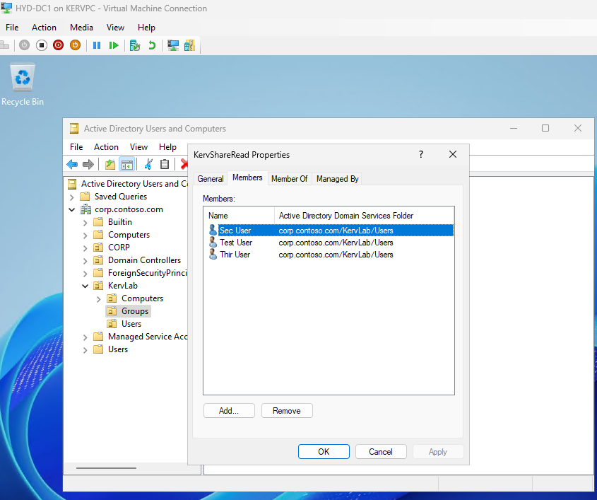
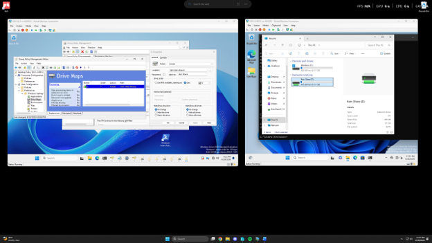
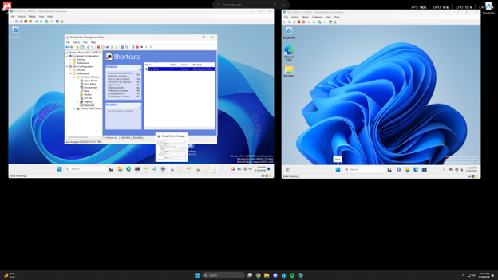
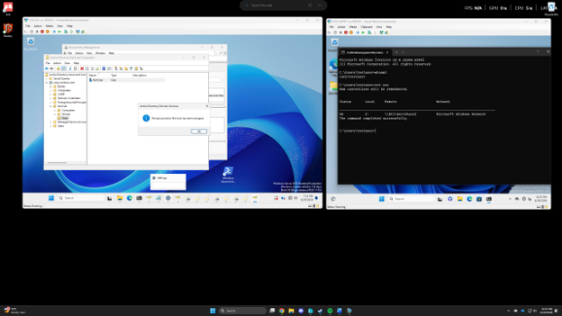

This project documents a Windows 11 deployment lab built in Hyper-V. The lab was used to practice Active Directory administration, Group Policy, domain user management, network file sharing, mapped drives, and help desk troubleshooting.

 Lab Environment
  - Hyper-V virtualization
  - Windows Server domain controller
  - Windows 11 domain-joined clients
  - Active Directory Domain Services
  - Group Policy Management
  - Network shared folder
  - Domain user and security group management

 Tasks Completed:
  - Logged into the domain controller
  - Created domain users in Active Directory
  - Created Organizational Units for users, computers, and groups
  - Deployed a desktop shortcut using Group Policy Preferences
  - Configured share and NTFS permissions
  - Created a security group for shared folder access
  - Mapped a shared drive using Group Policy
  - Configured domain password policy
  - Practiced password reset and account unlock workflows

Skills Demonstrated:
  - Active Directory administration
  - Group Policy configuration
  - File sharing and permissions
  - Password reset troubleshooting
  - Domain authentication troubleshooting
  - Basic help desk and junior system administration workflows

Troubleshooting Performed:
  - Domain Controller blocked access to its own SMB share
  - Group membership did not immediately appear until re-login
  - Group Policy shortcut required user policy troubleshooting

Outcome:
  The lab successfully demonstrated a small enterprise-style Windows domain environment where domain users could sign into a Windows 11 client, receive Group Policy settings, access a mapped network drive, and be managed through Active Directory.

Screenshots:

This is the creation of the group named "KervShareRead":

This shows the mapped drive,"Kerv Share", being created in the Domains Group policy named "Desktop Policy":

This demonstrates the creation of a shortcut that opens a file directly on the test users desktop:

This shows a successful password reset for one of the test users:

